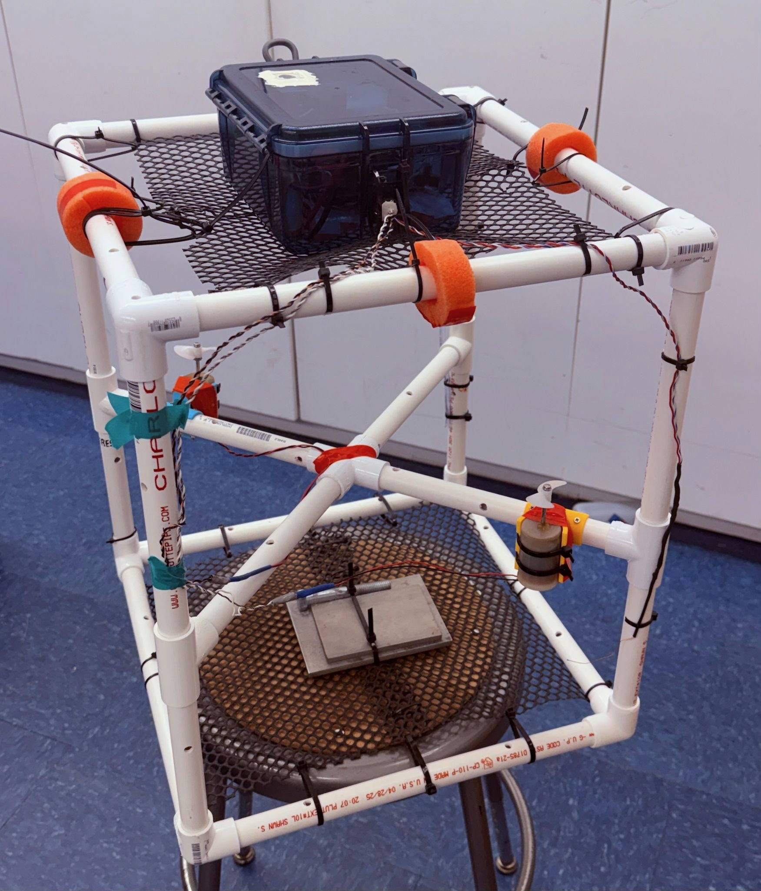
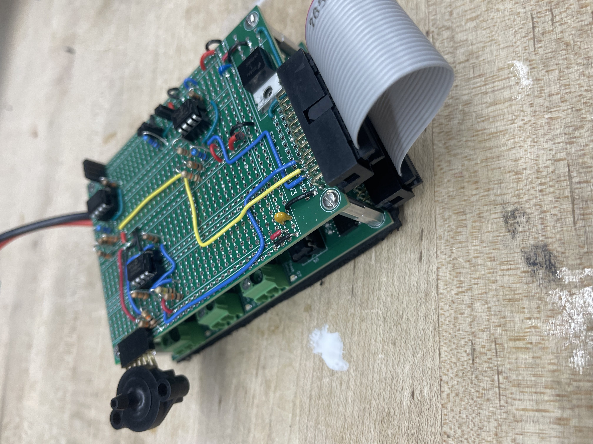
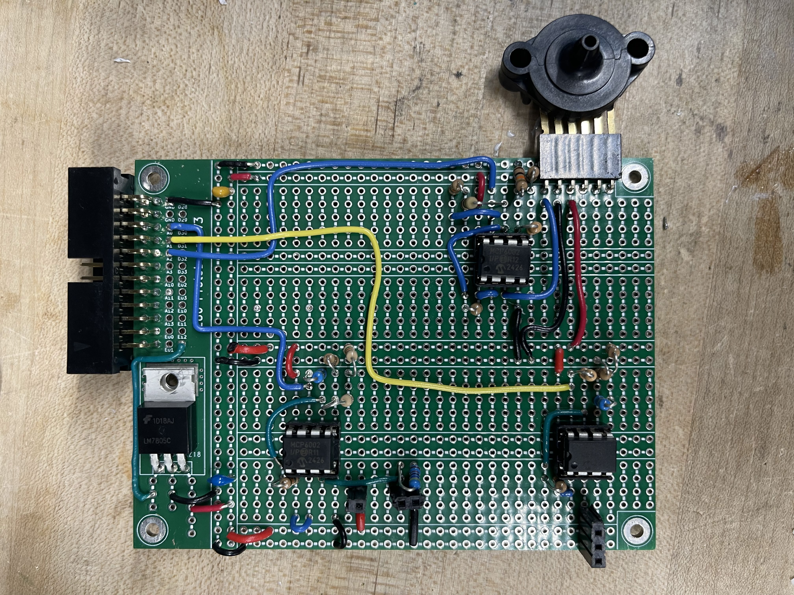
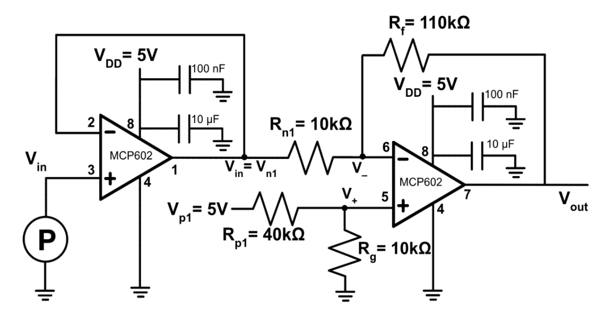
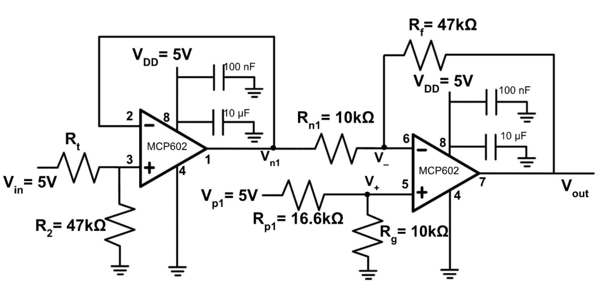
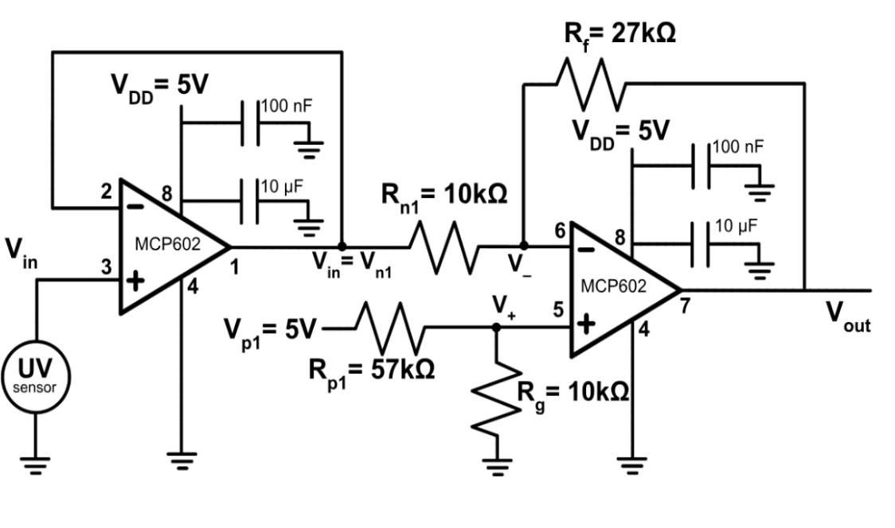
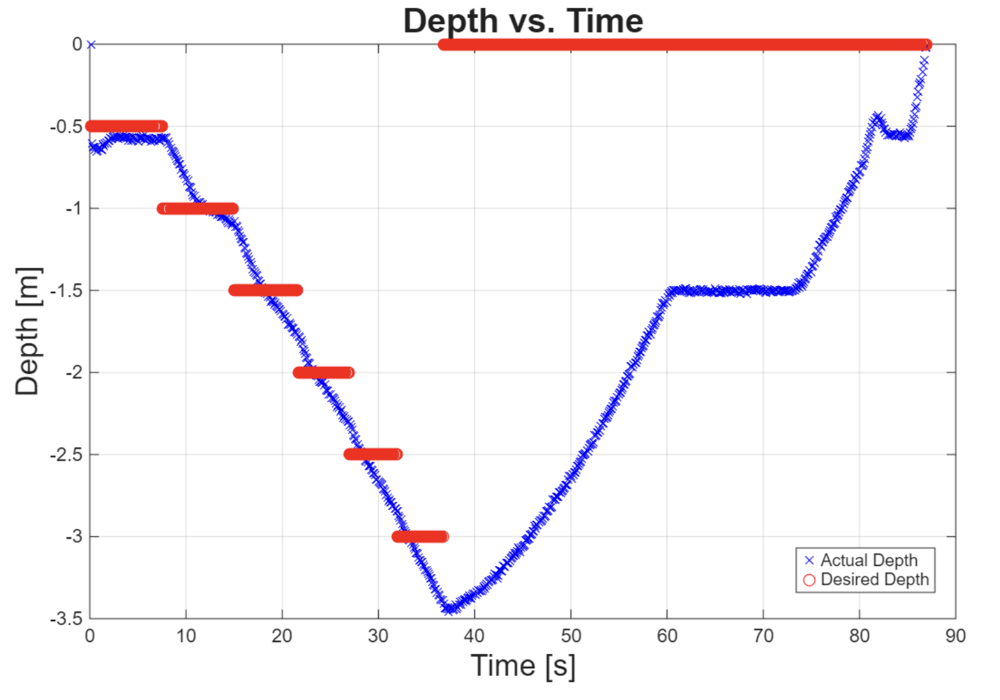
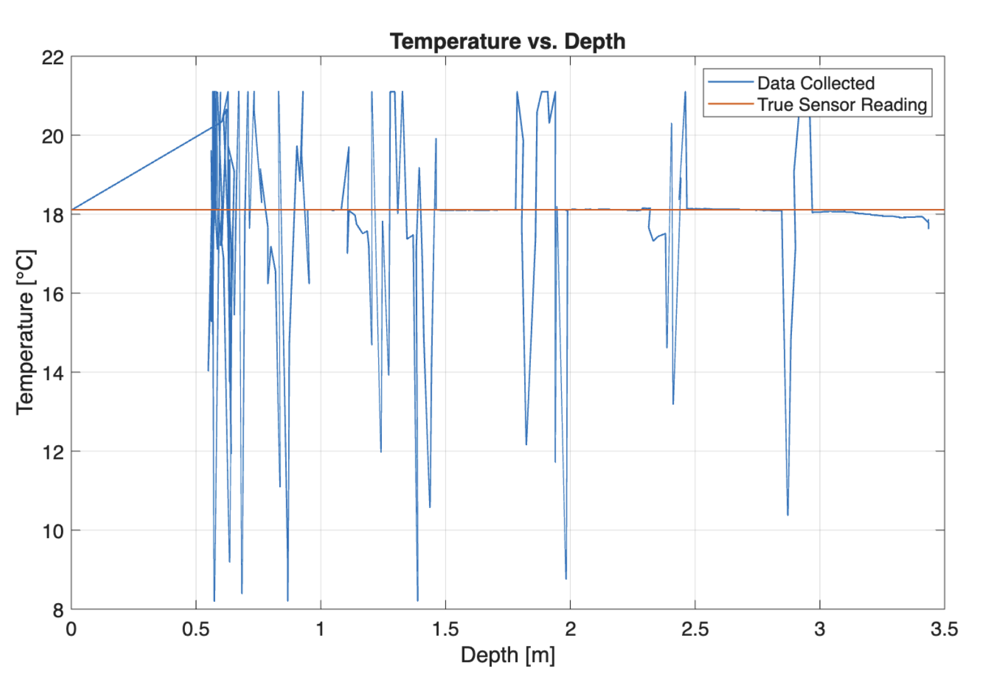
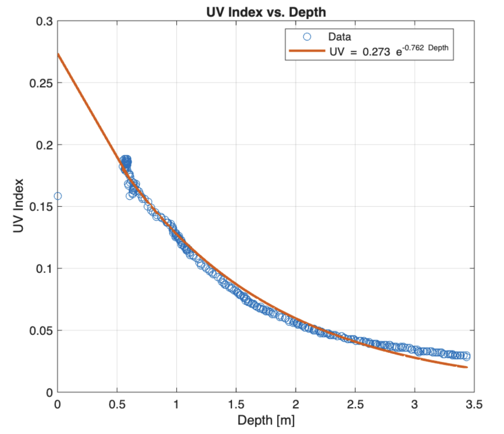

:::: {layout="[40,60]"}
::: {}
{.hero-image width=100%}
:::
::: {}
## Background

Climate change and ocean health monitoring require scalable, low-cost solutions for collecting environmental data. This project was motivated by the need to develop an autonomous system capable of measuring key ocean parameters at varying depths without human intervention. The goal was to design a robot that could reliably collect pressure, temperature, and UV data in real marine environments and contribute meaningful data for climate research.

:::
::::

---

## Contributions

- Led electrical system design, implementing 3 analog circuits with voltage-to-voltage, current-to-voltage, and resistance-to-voltage interfaces
- Engineered UV, pressure, and temperature sensor systems using a unity-gain buffer and inverting gain amplifier to optimize data resolution and prevent clipping on the Teensy 4.0
- Developed calibration protocols accounting for noise, sensor non-linearity, and degradation for accurate underwater measurements
- Designed and fabricated a mechanically stable system maintaining neutral buoyancy in saltwater while minimizing axial tilt
- Developed a C++ algorithm for dynamic depth control, enabling autonomous waypoint navigation at various depths
- Created MATLAB scripts to process and visualize temperature and UV intensity as a function of depth for climate monitoring analysis

---

## PCB Images

```{=html}
<div style="display: flex; gap: 20px; max-width: 750px; margin: 0 auto;">
  <div style="text-align: center; width: 50%;">
    
    <p style="font-size: 0.85rem; color: #666; margin-top: 5px;">Isometric PCB View</p>
  </div>
  <div style="text-align: center; width: 50%;">
    
    <p style="font-size: 0.85rem; color: #666; margin-top: 5px;">Top Down PCB View</p>
  </div>
</div>
```

---

## Sensor Interfaces

:::: {layout-ncol=3}
::: {}
{width=100%}
:::
::: {}
{width=100%}
:::
::: {}
{width=100%}
:::
::::

---

## Results

:::: {layout-ncol=3}
::: {}
{width=100%}
:::
::: {}
{width=100%}
:::
::: {}
{width=100%}
:::
::::

---

## Files

[View Technical Paper](../images/El_Seblani_Ali_E80_Final_Report.pdf) | [View Poster](../images/E80_Poster_Team42.pdf)

[Back to Projects](../projects.qmd)