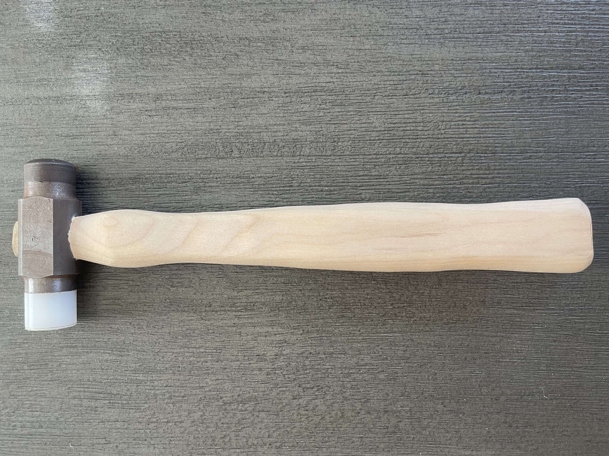

{.hero-image}

## Overview

Manufactured a precision machinist hammer from clear oak, AISI 1015 steel, AISI 4340 steel, and nylon, adhering to detailed engineering drawings, dimensional tolerances, and safety requirements. Applied turning, facing, milling, tapping, and heat treatment processes to achieve specified mechanical properties.

## Contributions

- Followed a process router and technical drawings to manufacture each component from raw materials
- Machined all components to tolerances within thousandths of an inch of technical specifications
- Calibrated and operated a lathe and mill to work with steel and nylon
- Applied manufacturing techniques including drilling, tapping, heat treatment, and tempering

## Skills

GD&T, Lathe, Mill, Bandsaw, Taps, Digital Micrometers, HRC Hardness Tester, Heat Treatment

## Files

[View Technical Drawings](../images/Hammer-Technical_Drawings.pdf)

[Back to Projects](../projects.qmd)