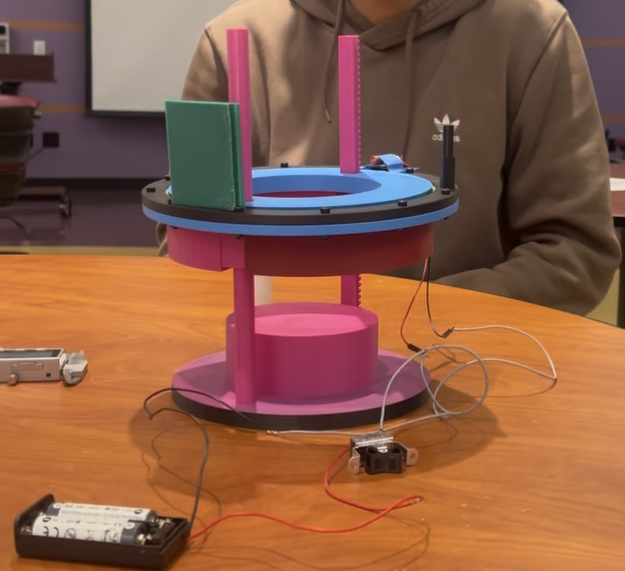

{.hero-image}

## Overview

Designed a precision rack and pinion Z-axis measurement system for SEM sample preparation achieving less than 1mm accuracy, preventing damage within the SEM chamber. Integrated a laser and photosensor with a slew bearing for radial motion to detect the tallest point on samples of variable height. Optimized durability through full material and fatigue analysis, selecting powder nylon for superior wear resistance and dimensional stability. Delivered a scalable, easily replicable design that improves SEM workflow safety and prevents $1000+ in potential equipment damage from improper sample height.

## Contributions

- Designed a precision rack and pinion Z-axis measurement system achieving less than 1mm accuracy for SEM sample preparation
- Integrated a laser and photosensor along with a slew bearing for radial motion to detect the tallest point on samples of variable height
- Optimized durability through full material and fatigue analysis, selecting powder nylon (SLS nylon) for superior wear resistance, strength, and dimensional stability under high cycle use
- Delivered a scalable, easily replicable design that improves SEM workflow safety and prevents $1000+ in potential equipment damage from improper sample height

## Skills

CAD, Rack and Pinion Design, Fatigue Analysis, Material Selection, SLS Nylon, SEM Sample Preparation

## Files

[View Technical Drawings, BOM & Process Router](../images/E4_Technical_Drawings_BOM_Process_Router.pdf)

[Back to Projects](../projects.qmd)