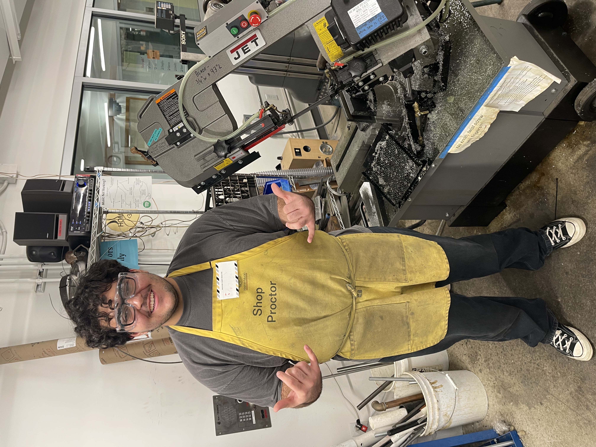

{width=100%}

## Overview

Regulated a space with 20+ heavy machines including mills, lathes, and CNC machines, promoting proper machine handling practices for 80+ students each semester. Guided students in Introduction to Engineering Design and Manufacturing and Mechanical Design courses on how to read and follow process routers and technical drawings to create a machinist's hammer to specification.

## Contributions

- Regulated a space with 20+ heavy machines (mills, lathes, CNC machines, etc.), promoting proper machine handling practices for 80+ students each semester
- Guided students in Introduction to Engineering Design and Manufacturing and Mechanical Design on how to read and follow process routers and technical drawings to create a machinist's hammer to specification
- Participated in weekly trainings that built up knowledge of machining, tooling, and manufacturing processes

## Skills

Machine Shop Safety, Machining, Tooling, Manufacturing Processes, Student Mentorship

## Links

[HMC Machine Shop](https://sites.google.com/g.hmc.edu/hmc-machine-shop/home?authuser=0)

[Back to Work Experience](../work_experience.qmd)