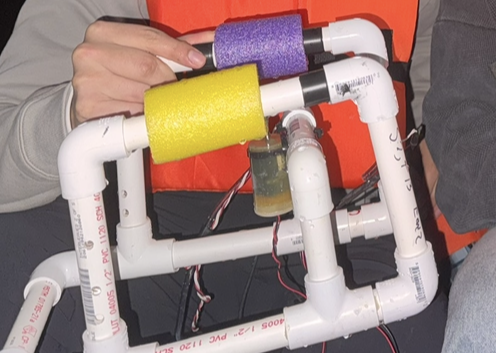

:::: {layout="[40,60]"}
::: {}
{.hero-image width=100%}
:::
::: {}
## Background

Underwater remotely operated vehicles provide a cost-effective solution for retrieving environmental data in aquatic settings. This project was motivated by the need to design and deploy a functional ROV capable of measuring temperature and pressure signals in lake environments. The goal was to develop a system that could reliably collect sensor data and process output voltages for analysis in LabVIEW.

:::
::::

---

## Contributions

- Constructed an underwater ROV to retrieve temperature, pressure, and other signals in lake environments
- Utilized the MCP9701 thermistor and MPX5700ASX pressure gauge for data collection
- Assembled a PCB containing the MCP6002 OpAmp to return output voltages
- Modeled and analyzed output voltages in LabVIEW

---

## Skills

LabVIEW, Soldering, PCB Assembly, Oscilloscope, DMM, Breadboarding

[Back to Projects](../projects.qmd)