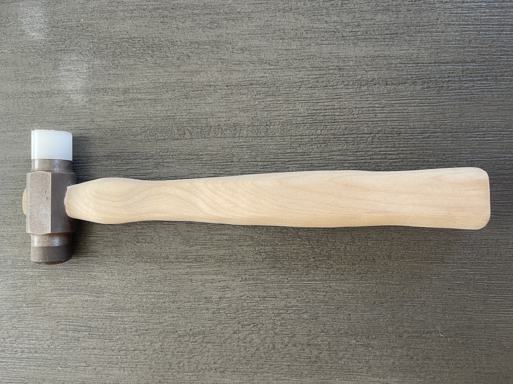

## Machinist's Hammer
**Engineering Project | Sept – Oct 2025**

:::: {layout-ncol=2}
::: {}
{width=80% height=300px}
:::
::: {}
{width=80% height=300px}
:::
::::

Designed and manufactured a machinist's hammer from raw materials, following a process router and technical drawings while machining components to precision tolerances within thousandths of an inch.

**What I Did**

- Followed a process router and technical drawings to manufacture each component from raw materials
- Machined all components to tolerances within thousandths of an inch of technical specifications
- Calibrated and operated a lathe and mill to work with steel and nylon
- Applied manufacturing techniques including drilling, tapping, heat treatment, and tempering

[View Technical Drawings](images/Hammer-Technical_Drawings.pdf)

---

## Autonomous Ocean Profiling Robot for Climate Monitoring
**Engineering Project | Jan – May 2026**

:::: {layout-ncol=3}
::: {}
{width=100% height=250px object-fit=cover}
:::
::: {}
{width=100% height=250px object-fit=cover}
:::
::: {}
{width=100% height=250px object-fit=cover}
:::
::::

**Sensor Interfaces**

:::: {layout-ncol=3}
::: {}
{width=100%}
:::
::: {}
{width=100%}
:::
::: {}
{width=100%}
:::
::::

Designed and developed a fully functional Autonomous Underwater Robot to collect and process pressure, temperature, and UV data at depths of up to 3 meters in marine environments at Dana Point.

**What I Did**

- Led electrical system design, implementing 3 analog circuits with voltage-to-voltage, current-to-voltage, and resistance-to-voltage interfaces
- Engineered UV, pressure, and temperature sensor systems using a unity-gain buffer and inverting gain amplifier to optimize data resolution and prevent clipping on the Teensy 4.0
- Developed calibration protocols accounting for noise, sensor non-linearity, and degradation for accurate underwater measurements
- Designed and fabricated a mechanically stable system maintaining neutral buoyancy in saltwater while minimizing axial tilt
- Developed a C++ algorithm for dynamic depth control, enabling autonomous waypoint navigation at various depths
- Created MATLAB scripts to process and visualize temperature and UV intensity as a function of depth for climate monitoring analysis

[View Technical Paper](images/El_Seblani_Ali_E80_Final_Report.pdf) | [View Poster](images/E80_Poster_Team42.pdf)